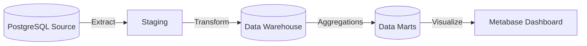

# Enterprise Customer & Revenue Analytics Platform

**Data Engineering Portfolio Project**

---

## 📖 Overview

A comprehensive, end-to-end Data Engineering platform simulating a real-world E-commerce environment. This project demonstrates the transformation of raw transactional data into actionable Customer 360 insights using modern Data Warehouse architecture.

**Key Features:**
- **Modern Data Stack**: Docker, PostgreSQL, Python, Airflow (concept), data testing.
- **Star Schema Data Warehouse**: Normalized dimension & fact tables for scalable analytics.
- **Customer 360 Mart**: Single view of customer with RFM segmentation and LTV analysis.
- **Data Quality & Reconciliation**: Automated checks ensuring orders match payments and invoices.

---

## 🏗 Architecture



### Components
1.  **Source System**: Simulated E-commerce DB (Orders, Products, Customers).
2.  **Core DW**: Standard Star Schema (`dim_customer`, `fact_sales`, etc.).
3.  **Analytics Layer**: 
    - **Customer 360**: Unified profile & behavior metrics.
    - **RFM Analysis**: Recency, Frequency, Monetary scoring.
    - **Financial Reconciliation**: Automated 3-way matching.

---

## 🚀 Quick Start

### Prerequisites
- Docker & Docker Compose
- Python 3.10+

### Setup & Run
1.  **Clone the repository**:
    ```bash
    git clone <repo-url>
    cd Enterperise_DE
    ```

2.  **Start Services**:
    ```bash
    docker-compose up -d
    ```

3.  **Run ETL Pipeline**:
    ```bash
    # Run full load pipeline
    python src/transform/run_dw_etl.py
    
    # Run Customer 360 mart build
    python src/transform/load_customer360.py
    ```

4.  **Check Data Quality**:
    ```bash
    python src/data_quality/validator.py
    ```

---

## 📊 Analytics & Dashboards

### Customer Segmentation (RFM)
Customers are segmented based on their purchasing behavior:
- **Champions**: High spenders, recent buyers.
- **Loyal Customers**: Consistent buyers over time.
- **At Risk**: High value but haven't purchased recently.

### Reconciliation Report
Tracks discrepancies between Order System and Payment Gateway to prevent revenue leakage.

---

## 🛠 Technology Stack

- **Database**: PostgreSQL 14
- **ETL Language**: Python 3.10 (Pandas, SQLAlchemy)
- **Containerization**: Docker
- **Testing**: pytest (Unit), Great Expectations (Data Quality logic)
- **CI/CD**: GitHub Actions

---

## 📝 License
MIT License. Created for Portfolio demonstration.
